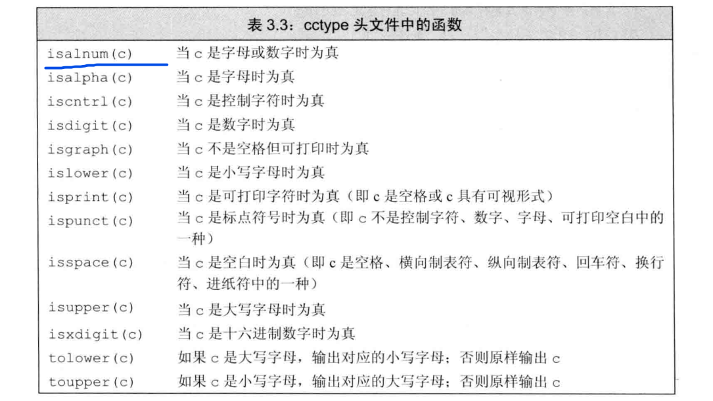
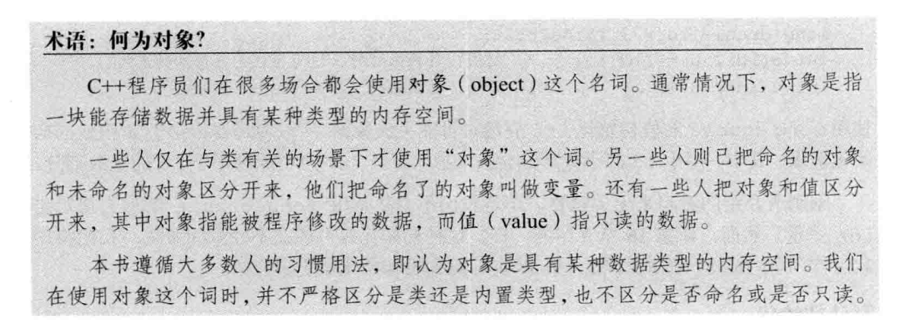

任何常用的编程语言都具备一组公共的语法特征，不同语言仅在特征的细节上有所区别。要想学习并掌握一种编程语言，理解其语法特征的实现细节是第一步。最基本的特征包括:

- 整型、字符型等内置类型。
- 变量，用来为对象命名。
- 表达式和语句，用于操纵上述数据类型的具体值。
- if或while等控制结构，这些结构允许我们有选择地执行一些语句或者重复地执行一些语句。
- 函数，用于定义可供随时调用的计算单元。

大多数编程语言通过两种方式来进一步补充其基本特征：

1. 赋予程序员自定义数据类型的权利，从而实现对语言的扩展。

2. 将一些有用的功能封装成库函数提供给程序员。

   ​																															-------《C++ Primer 5th》page: 29

# 第1章 变量与基本类型

## OUTLINE

- 基本类型及其大小
- 符号与无符号 => 不谈了
- 类型转换
- 为数据选用合适的类型 => 知道就好
- 字面值**常量** => 无聊的定义，为了完备语言而设立。
- **变量**的初始化。 如果是自定义类型的话，必须做好默认初始化！
- 复合类型： 引用与指针
- `const` 如果一个变量我们不需要修改它，请加上const

## 1.1 基本类型与其大小

| 类型          | 含义           | 最小尺寸         |
| ------------- | -------------- | ---------------- |
| `bool`        | 布尔类型       | Undefined        |
| `char`        | 字符           | 8位              |
| `wchar_t`     | 宽字符         | 16位             |
| `char16_t`    | Unicode字符    | 16位             |
| `char32_t`    | Unicode 字符   | 32位             |
| `short`       | 短整型         | 16位             |
| `int`         | 整型           | 16位             |
| `long`        | 长整型         | 32位             |
| `long long`   | 长整型         | 64位             |
| `float`       | 单精度浮点数   | **6位有效数字**  |
| `double`      | 双精度浮点数   | **10位有效数字** |
| `long double` | 扩展精度浮点数 | **10位有效数字** |

以上是标准的规定，实际上的大小应该在具体编译器的`<limits.h>`中查找，比如`gcc 9 `中 `int`占四个字节。

> 除字符和布尔类型之外，其他整型用于表示（可能）不同尺寸的整数。C＋＋语言规定一个`int`至少和一个`short`一样大，一个`1ong`至少和一个`int`一样大，一个`1ong long`至少和一个`1ong`一样大。
>
> 其中，数据类型1ong 1ong是在C＋＋11中新定义的。

## 1.2 类型转换

拒绝隐式转换，需要转换需要显式，且使用C++11提供的。

**有符号与无符号的转换，与不同类型间的转换。**

类型所能表示的**值的范围决定了转换**的过程：

- **当我们把一个非布尔类型的算术值赋给布尔类型时，初始值为0则结果为false，否则结果为true。**

- 当我们把一个布尔值赋给非布尔类型时，初始值为 false 则结果为0，初始值为true 则结果为1。

- 当我们把一个浮点数赋给整数类型时，进行了近似处理。结果值将仅保留浮点数中小数点之前的部分。

- 当我们把一个整数值赋给浮点类型时，小数部分记为0。如果该整数所占的空间超过了浮点类型的容量，精度可能有损失。

- 当我们赋给无符号类型一个超出它表示范围的值时，**结果是初始值对无符号类型表示数值总数取模后的余数。**

- **当我们赋给带符号类型一个超出它表示范围的值时，结果是未定义的（undefined）。此时，程序可能继续工作、可能崩溃，也可能生成垃圾数据。**

## 1.3 初始化

C++语言定义了许多初始化方式。请使用`{}`来做初始化，这样会更安全。

如果发生隐式类型转换，使用`{}`作为初始化的方式会报错。

- 全局变量与静态变量会被默认初始化成0
- 定义在函数内部的变量未初始化的话，值是未知的。

**自己编写的类，应该提供一个默认初始化的值。这样是好的。**

对于 每个创建的内置类型，创建时即要初始化！！

## 1.4 复合类型

由基本类型与一个声明符来组成。

### 1.4.1 引用 在函数的章节再谈吧，这里说没有太多用处。

引用是给对象的别名。一般在初始化变量时，初始值会被拷贝到新建的对象中。然而定义引用时，程序把引用和它的初始值绑定（bind）在一起，而不是将初始值拷贝给引用。

一旦初始化完成，**引用将和它的初始值对象一直绑定在一起。**因为无法令引用重新绑定到另外一个对象，**因此引用必须初始化。**

引用的绑定对象必须是一个对象！不能是一个字面值常量。

右值引用绑定的被视作一个常量，用完即丢的那种，即不占存储空间。

### 1.4.2 指针

**指针会指向一个对象。指针也可以说是一种基本类型。** 不推荐使用`raw pointer` 这里就不介绍了。

- 因为引用不是对象，所以不存在指向引用的指针。

为了下文介绍智能指针做铺垫，我们这里抽象的介绍下指针的概念。

```c++
int *ip; // 定义一个指针对象。
char *cp = nullptr; //定义并且初始化一个指针对象。
```

指针由两个基本操作，取地址(&)与解引用(*):

```c++
ip = &cp; // 可以通过这种方式来为指针变量赋值。
*ip == cp // 通过* 来访问指针指向的变量。
cp = ip //是不允许的，因为编译器其实无法知道指针指向的内容的类型，它需要通过指针的类型来做推理！
int t = 15;
ip = t // 不允许的！ 不要把一个数值赋给指针类型，即便它是0
```

>  Q ：`nullptr`的类型是？
>
> 相信编译器，编译器是万能的！

```c++
// 在过去
#define NULL 0  // in <cstdlib> 中

#define NULL (void *)0 // ?我印象里是这样的， 但是我也不太清楚这样是不是符合标准的。 

char * cp = NULL;
char * cp = 0;
char * cp = nullptr; 
// 是一样的,推荐写成nullptr,但是0也可以。
// 写成NULL比较麻烦，并且与写0的效果是一样的。
```

## 1.5 `const`

`const int SIZE = 10` 会被当作宏，进行编译时替换，所以在编译时，程序必须知道`const int SIZE`的值。进而这个语句会被限制在文件内。

如果不想每个文件都定义一份这个，需要将声明变成`extern const int SIZE = 10`。


### 1.5.1 ！！重点 对& 施加const

`const int &a = b`,不能通过a来修改b。这是非常有必要的！特别是在函数的参数传递的过程中

### 1.5.2 `const`的指针

-面试经典考点，但是不推荐使用`raw pointer` ，请使用`smart_pointer`.

1. 指向常量的指针，请从右向左阅读。`const double *ptr`

   > 正如前面所说，指针其实对指向的对象并无约束力，只是它自以为是的将自己指向的那个地址解释成一个`type`类型的值，现在，他又异想天开的觉得这个值是个`const`。

2. 指针是对象，所以指针本身也可以是常量。请从右向左阅读`double * const ptr`。这样的指针满足常量的基本原则，即必须被初始化{可以是默认初始化}，且初始化之后不能被修改。

### 1.5.3 `diff` 顶层`const`与底层`const`

- 顶层`const`指对象本身不可变。

- 而底层`const`是指针与引用所独有的，是一厢情愿的认为他们指向/绑定的变量是一个常量。故底层`const`仅仅只能约束他们自身，而不能约束他人，甚至指向的变量本身对自己做的修改。

### 1.5.4 `constexpr`

这样的表达式会被称作`constexpr`:

- 不会改变结果

- 编译器就能确定结果

  如果你觉得一个常量是`constexpr`,那就大胆的声明吧。编译器会帮助我们做决策。与之配对的可以编写`constexpr`的函数，来帮助编译器做 `i = func() is constexpr`的决策。

## 1.6 处理类型

### 1.6.1  type alias :  `typedef`与`using`

```c++
typedef char *pstring;
const pstring cstr = 0;
using pstring  = char *;
decltype(cstr) ? 
```

不能简单的将别名理解成宏替换。

```c++
typedef char* pstring;
const pstring cstr = 0;
const char *cstr = 0; 
```

的含义不同，前者`const`修饰的是`pstring`，是一个指针类型，后者`const`在修饰`char`。

## 1.6.2 `auto`

- `auto`会使编译器进行计算类型。由于是编译期计算，这会导致auto的变量必须是被初始化的。

- `auto`会忽略顶层`const`，保留底层`const`。所以如果需要`const`的`auto`,需要显式加上，变成`const auto`。

## 1.6.3 `decltype`

计算类型 ...

## 1.7 `summary`

- 类型是C＋＋编程的基础。
- 类型规定了其对象的存储要求和所能执行的操作。C＋＋语言提供了一套基础内置类型，如int和char等，这些类型与实现它们的机器硬件密切相关。
- 类型分为非常量和常量，一个常量对象必须初始化，而且一旦初始化其值就不能再改变。
- 此外，还可以定义复合类型，如指针和引用等。复合类型的定义以其他类型为基础。
- C＋＋语言允许用户以类的形式自定义类型。C＋＋库通过类提供了一套高级抽象类型，如I/O和string等。 

# 第2章  字符串、向量和数组

除了内置类型之外，C＋＋语言还定义了一个内容丰富的抽象数据类型库。其中，string和vector是两种最重要的标准库类型，前者支持可变长字符串，后者则表示可变长的集合。还有一种标准库类型是迭代器，它是string和vector的配套类型，常被用于访问string中的字符或vector中的元素。

内置数组是一种更基础的类型，string和vector 都是对它的某种抽象。本章将分别介绍数组以及标准库类型string和vector。

## 2.1 命名空间的using声明

`using std::string`

## 2.2 标准库类型 string





## 2.3 标准库类型 vector


## 2.4 迭代器介绍


## 2.5 数组

## 2.6 多维数组

# 第3章  表达式

C++语言提供了一套丰富的运算符，并定义了这些运算符作用于内置类型的运算对象时所执行的操作。此外，C++语言还支持**运算符重载**的机制，允许我们自己定义运算符作用于类类型时的含义。

对于含有超过一个运算符的表达式，要想理解其含义关键要理解**优先级、结合律和求值顺序**。每个运算符都有其对应的优先级和结合律，优先级规定了复合表达式中运算符组合的方式，结合律则说明当运算符的优先级一样时应该如何组合。

大多数运算符并不明确规定运算对象的求值顺序：**编译器有权自由选择先对左侧运算对象求值还是先对右侧运算对象求值。**一般来说，运算对象的求值顺序对表达式的最终结果没有影响。但是，如果两个运算对象指向同一个对象而且其中一个改变了对象的值，就会导致程序出现不易发现的严重缺陷。

最后一点**，运算对象经常从原始类型自动转换成某种关联的类型**。例如，表达式中的小整型会自动提升成大整型。不论内置类型还是类类型都涉及类型转换的问题。如果需要，我们还可以显式地进行强制类型转换。

**C++11新标准允许使用花括号括起来的初始值列表作为赋值语句的右侧运算对象:**

```c++
int k = {3.14}; //错误，窄化转换
vector<int> vi; //初始为空

vi = {0,1,2,3,4,5,6,7,8,9}; //vi现在含有10个元素了，值从0到9
```

## 强制类型转换

- `static_cast<type>()`只要不包含底层const，都可以使用这种方式。

  ```c++
  int i,j;
  double slope = static_cast<double>(i)/j;
  ```

- `dynamic_cast<type>()`

- `const_cast<type>()`

  常用于去除变量的顶层`const`的属性。也就是说，可以对对象进行写操作了。

- `reinterpret_cast<type>()`

  reinterpret＿cast 通常为运算对象的位模式提供较低层次上的重新解释。

  

# 第4章  语句(控制流)

和大多数语言一样， C++提供了条件执行语句、重复执行相同代码的循环语句和用于中断当前控制流的跳转语句。本章将详细介绍C++语言所支持的这些语句。

- `if else`
- `for while`
- `switch case`
- `throw try catch`


# 第5章 函数

函数是命名了的计算单元，它对程序（哪怕是不大的程序）的结构化至关重要。每个函数都包含返回类型、名字、（可能为空的）形参列表以及函数体。函数体是一个块，当函数被调用的时候执行该块的内容。此时，传递给函数的实参类型必须与对应的形参类型相容。

在C++语言中，函数可以被重载：同一个名字可用于定义多个函数，只要这些函数的形参数量或形参类型不同就行。根据调用时所使用的实参，编译器可以自动地选定被调用的函数。从一组重载函数中选取最佳函数的过程称为函数匹配。

## 5.1 使用引用避免拷贝

拷贝大的类类型对象或者容器对象比较低效，甚至有的类类型(`e.g iostream`)。根本就不支持拷贝操作。当某种类型不支持拷贝操作时，函数只能通过引用形参访问该类型的对象。

举个例子，我们准备编写一个函数比较两个string对象的长度。因为string对象可能会非常长，所以应该尽量避免直接拷贝它们，这时使用引用形参是比较明智的选择。

**又因为比较长度无须改变 string 对象的内容，所以把形参定义成对常量的引用。**

```c++
bool isShorter(const string &s1,const string &s2){
    return s1.size() < s2.size();
}
```

## 默认实参

通常，默认实参在声明中指定，声明又是应该放在一个合适的 头文件中的。

## 调试的好兄弟`assert`

`assert`是一种预处理宏`(preprocessor marco)`。所谓预处理宏其实是一个预处理变量，它的行为有点类似于内联函数。`assert`宏使用一个表达式作为它的条件：

```c++
assert(expr);
```

首先对`expr`求值，如果表达式为`false`（即0），`assert `输出信息并终止程序的执行。如果表达式为`true`（即非0），assert什么也不做。

## 关闭`assert`的求值

我们可以使用一个`#define`语句定义`NDEBUG`，从而关闭调试状态。同时，很多编译器都提供了一个命令行选项使我们可以定义预处理变量：

```
$ CC -D NDEBUG main.C # use /D with the Microsoft compiler 这条命令的作用
```

等价于在`main.c`文件的一开始写`#define NDEBUG`。

## 有用的预处理宏

```c++
__func__: 函数名
__FILE__: 文件名
__LINE__: 当前行号
__TIME__: 当前时间
__DATE__: 当前日期
```

# 第6章 类

在C＋＋语言中，我们使用类定义自己的数据类型。通过定义新的类型来反映待解决问题中的各种概念，可以使我们更容易编写、调试和修改程序。

本章是第2章关于类的话题的延续，主要关注数据抽象的重要性。数据抽象能帮助我们将对象的具体实现与对象所能执行的操作分离开来。第13章将讨论如何控制对象拷贝、移动、赋值和销毁等行为，在第14章中我们将学习如何自定义运算符。

# Q&A and Potpourri

## 流与过滤 ch1

本书中的很多示例都使用了`iostream`库。`iostream` 库包含两个基础类型`istream `和`ostream`，分别表示输入流和输出流。

- 一个流就是一个字符序列，是从IO设备读出或写入IO设备的。

- 术语“流”（stream）想要表达的是，随着时间的推移，字符是顺序生成或消耗的。

流即序列，过滤，化简，映射，是流不变的话题

## 真正被写入到流中？`flush`ch1

第二个运算符打印`endl`，这是一个被称为操纵符（manipulator）的特殊值。写入`endl`的效果是结束当前行，并将与设备关联的缓冲区`（buffer）`中的内容刷到设备中。

**缓冲刷新操作可以保证到目前为止程序所产生的所有输出都真正写入输出流中，而不是仅停留在内存中等待写入流。**

> 程序员常常在调试时添加打印语句。这类语句应该保证“一直”刷新流。否则，如果程序崩溃，输出可能还留在缓冲区中，从而导致关于程序崩溃位置的错误推断。 

## 1与2 有什么不同？ `move`与`explicit`关键字的语义  ch1

```c++
explicit Sales_item(std::string book): bookNo(std::move(book)) { }
explicit Sales_item(const std::string &book): bookNo(book) { }
```

## 初始化与赋值 ch2

初始化不是赋值，初始化的含义是创建变量时赋予其一个初始值，而赋值的含义是**把对象的当前值擦除**，而以一个新值来替代。

## 变量的声明与定义 ch2

```c++
extern int i; // 声明 i
int j; //定义 j
extern double pi = 3.1416; // 定义
```

变量只能定义一次，但是可以被声明多次。将变量的声明与定义分离，是为了能够实现分离编译。

声明使名字被程序所知，定义负责创建与名字关联的实体。

## diff Python,C++

由于变量的类型决定我们的运算的成立性，从这个角度来看，静态的类型检查，比python的运行时决定类型要好。

##  code style for google

关于代码风格，一个好的方法是使用clang-format。

### 变量命名的一些经验

变量命名有许多约定俗成的规范，下面的这些规范能有效提高程序的可读性：

- 标识符要能体现实际含义。

- 变量名一般用小写字母，如index，不要使用Index或INDEX。

- 用户自定义的类名一般以大写字母开头，如Sales＿item。

- 如果标识符由多个单词组成，则单词间应有明显区分，如 student＿loan 或studentLoan，不要使用studentloan。

>  对于命名规范来说，若能坚持，必将有效。

## 关于查找问题中的`mid = beg + 1`

....

## 尽量使用前置++

建议：除非必须，否则不用递增递减运算符的后置版本

有C语言背景的读者可能对优先使用前置版本递增运算符有所疑问，其实原因非常简单：**前置版本的递增运算符避免了不必要的工作，它把值加1后直接返回改变了的运算对象。**与之相比，**后置版本需要将原始值存储下来**以便于返回这个未修改的内容。如果我们不需要修改前的值，那么后置版本的操作就是一种浪费。

> 对于整数和指针类型来说，编译器可能对这种额外的工作进行一定的优化；但是对于相对复杂的迭代器类型，这种额外的工作就消耗巨大了。建议养成使用前置版本的习惯，这样不仅不需要担心性能的问题，而且更重要的是写出的代码会更符合编程的初衷。

## 使用`*iptr++` 小而美

**建议：简洁可以成为一种美德**

形如`*pbeg++`的表达式一开始可能不太容易理解，但其实这是一种被广泛使用的、有效的写法。当对这种形式熟悉之后，书写:

```c++
cout << *iter++ << endl;
```

要比书写下面的等价语句更简洁、也更少出错

```c++
cout << *iter << endl;
++iter;
```

不断研究这样的例子直到对它们的含义一目了然。

大多数C++程序追求简洁、摒弃冗长，因此C++程序员应该习惯于这种写法。而且，一旦熟练掌握了这种写法后，程序出错的可能性也会降低。

## 何时发生隐式类型转换

在下面这些情况下，编译器会自动地转换运算对象的类型:

- 在大多数表达式中，比int类型小的整型值首先提升为较大的整数类型。
- 在条件中，非布尔值转换成布尔类型。
- 初始化过程中，初始值转换成变量的类型。
- 在赋值语句中，右侧运算对象转换成左侧运算对象的类型。
- 如果算术运算或关系运算的运算对象有多种类型，需要转换成同一种类型。
- 如第6章将要介绍的，函数调用时也会发生类型转换，

## `switch case`中 不要忘记`default`

即使不准备在default 标签下做任何工作，定义一个`default`标签也是有用的。

其目的在于告诉程序的读者，我们已经考虑到了默认的情况，只是目前什么也没做。

## 不要在有`size`的语句中出现`int`

如果一条表达式中已经有了`size()`函数就不要再使用`int`了，这样可以避免混用`int`和`unsigned`可能带来的问题。

## 循环之后也要提供`return` 

函数在for 循环之后没有提供return 语句。编译器也许能检测到这个错误，也许不能；如果编译器没有发现这个错误，则运行时的行为将是未定义的。

在含有return语句的循环后面应该也有一条return语句，如果没有的话该程序就是错误的。很多编译器都无法发现此类错误。

# 准则！

- 避免隐式类型转换。

- 避免使用`raw pointer`
- 

## 引用不是对象 ch2



引用不是对象，因为它不占用内存空间。而指针是一个对象。

## 阅读复杂声明 the C .....K&R

从右向左比较容易。

## 初始化的方式与方法。

目前，请使用`{}`作为唯一的初始化方式，这样可以避免很多不必要的麻烦。

默认初始化，零初始化，值初始化，直接初始化，拷贝初始化，引用初始化，聚合初始化，列表初始化（或统一初始化）
