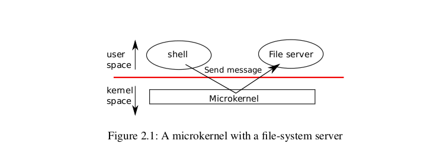
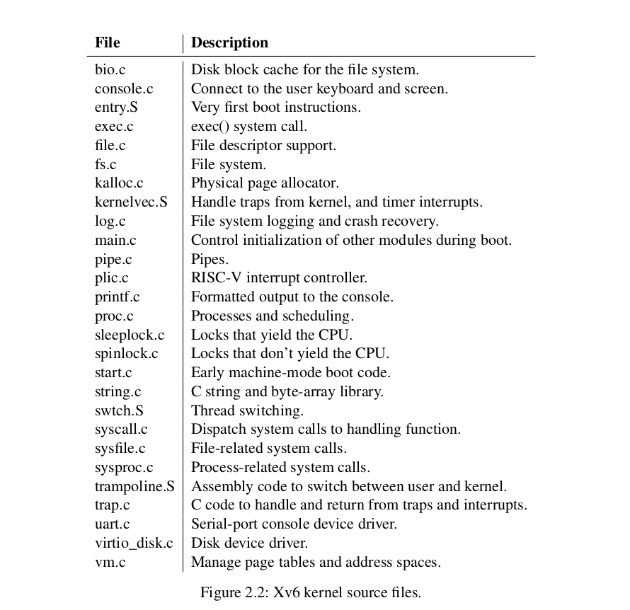
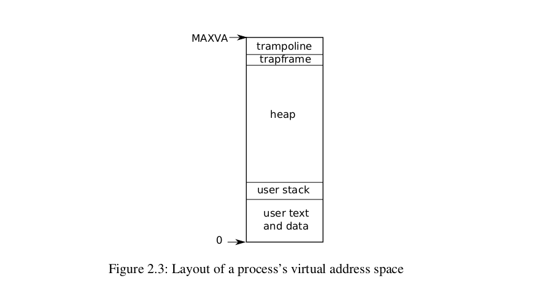

# 第2章 操作系统组织

操作系统的一个关键要求是支持并发。例如，使用第1章中描述的系统调用接口，一个进程可以使用fork()启动新的进程。

操作系统必须在这些进程之间分时共享计算机的资源。例如，即使进程比硬件CPU个数更多，操作系统也必须确保所有进程都有机会执行。

操作系统还必须安排进程之间的隔离。也就是说，如果一个进程有bug和故障，它不应该影响与错误进程不相干的进程。但是，完全的隔离太强了，进程应该可以有意地同其他进程进行交互,管道就是一个例子。

因此，一个操作系统必须满足三个要求：多路复用、隔离和交互。

本章概述了如何组织操作系统以实现多路复用、隔离和交互。事实证明，有很多方法可以做到这一点，但本文主要关注以单片内核为中心的主流设计（许多Unix操作系统都使用单片内核)。本章还概述了xv6进程的实现，进程是xv6中的隔离单元。最后，我们简单叙述了xv6启动时,第一个进程的创建的过程。

xv6运行在多核RISC-V微处理器上，其许多低级功能(例如，其进程的实现)都是特定于RISC-V的。此处理器是64位的，xv6是用“LP64”C编写的，这意味着C编程语言中的long(L)和pointer(P)是64位，但int是32位。这本书假设读者已经在某些架构上做了一些机器级的编程，并将在它们出现时介绍risc-v特定的想法。

> A useful reference for RISC-V is “The RISC-V Reader: An Open Architecture Atlas” [13]. The user-level ISA [2] and the privileged architecture [1] are the offificial specififications.

在一台完整的计算机中，CPU被支持的硬件包围，其中大部分以I/O接口的形式存在。xv6是在qemu的`-machine virt`选项模拟的硬件上编写的。支持的硬件包括RAM、ROM（存放启动代码）、与用户键盘/屏幕的串行连接以及用于存储的磁盘。

## 2.1 抽象物理资源

遇到操作系统时，人们可能会问的第一个问题是，为什么要使用它？换句话说，可以将所有的系统调用实现为一个库，应用程序与之进行链接。在这个方案中，每个应用程序可以根据自己的需求定制自己的库。应用程序可以直接与硬件资源交互，并以应用程序的最佳方式(实现高性能或可预测的性能)使用这些资源。一些用于嵌入式设备或实时系统的操作系统就是这样组织的。

这种库方案的缺点是，如果有多个应用程序在运行，则这些应用程序必须行为良好。例如，每个应用程序必须定期放弃CPU，以便其他应用程序可以运行。

如果所有应用程序都相互信任并且没有bug，那么这种协作分时方案就可以了。对于应用程序来说，更典型的情况是彼此不信任，并且存在bug。因此人们通常希望提供的隔离性比协作方案提供的隔离更强大。

为了实现强隔离，禁止应用程序直接访问敏感的硬件资源，将资源抽象为服务是很有必要的。例如，Unix应用程序仅通过文件系统提供的open(),read(),write(),close(),这样的系统调用来与存储交互，而不是直接读取和写入磁盘。这为应用程序提供了路径名的便利，并允许操作系统(作为接口的实现者)管理磁盘。 即使不考虑隔离，有意进行交互(或只是希望避开对方)的程序，也可能会发现借助于文件系统是比直接使用磁盘更方便的。

类似地，Unix透明地在进程之间切换硬件CPU，根据需要保存和恢复寄存器状态，应用程序并不知道他们其实分时复用了CPU。操作系统依赖这种透明性，使应用程序之间能够共享CPU，即使某些应用程序处于无限循环中。

另一个例子是，Unix进程使用exec()构建其内存映像，而不是直接与物理内存交互。这允许操作系统来决定进程存放在内存中的位置；如果内存很吃紧，操作系统甚至可能将进程的一些数据存储在磁盘上（ps：或者随机选个幸运儿进程直接杀掉（for linux））。除此之外，exec()还为用户提供了文件系统存储可执行程序映像的便利。

Unix进程之间的许多形式的交互都是通过文件描述符发生的。文件描述符不仅抽象化了许多细节（例如，管道或文件中的数据存储的位置），而且简化了它们之间的交互方式。例如，如果管道中的一个应用程序失败，内核将为管道中的下一个进程生成一个EOF信号。

图1.2中的系统调用接口经过精心设计，既为程序员提供了方便，又提供了强大隔离的可能性。**Unix接口不是抽象资源的唯一方法，但它已被证明是一种非常好的方法。**

## 2.2 特权模式与系统调用

强隔离要求应用程序和操作系统之间有一个硬边界。 如果应用程序出错，我们不希望操作系统或其他应用程序出现故障。相反，操作系统应该能够清理失败的应用程序并继续运行其他应用程序。为了实现强隔离，操作系统必须安排应用程序不能修改(甚至读取)操作系统的数据结构和指令，并且应用程序不能访问其他进程的内存。

CPU为强隔离提供硬件支持。例如，RISC-V有三种CPU可以执行指令的模式：Machine mode、Supervior mode和User mode。 在机器模式下执行的指令具有完全权限；CPU以机器模式启动。机器模式主要用于配置计算机。xv6在Machine mode下执行几行，然后更改为Supervior mode。

在Supervior mode中，CPU可以执行特权指令：例如，启用和禁用中断，读取和写入保存页表地址的寄存器等。如果User mode的应用程序尝试执行特权指令，则CPU不会执行该指令，但是会切换到Supervior mode，以便Supervior mode的代码可以终止应用程序。第1章中的图1.1说明了该组织。 应用程序只能执行User mode指令，并被称为在用户空间中运行，而处于Supervior mode的软件可以执行特权指令，并被称为在内核空间中运行。在内核空间(或Supervior mode)中运行的软件称为内核。

想要调用内核函数的应用程序(例如，xv6中的read())必须转换到内核。应用程序不能直接调用内核函数，CPU提供一条特殊指令，将CPU从User mode切换到Supervior mode，并在内核指定的入口点进入内核。(RISC-V为此提供ecall指令。)一旦CPU切换到Supervior mode，内核就可以验证系统调用的参数（例如，检查传递给系统调用的地址是否是应用程序内存的一部分），决定是否允许应用程序执行请求的操作（例如，检查应用程序是否允许写入指定的文件），然后拒绝或执行它。由内核来指定转换到Supervior mode的入口点是很关键的。如果应用程序可以决定内核入口点，那么恶意应用程序可能会在跳过参数验证的部分进入内核。

***

以下是我觉得有助于理解的两个点：
1. 默认情况下，RISC-V发生的所有的中断（interrupt）与异常（exception）都只能在M模式orS模式下处理。U模式不可以处理任何异常与中断，所以只要发生了中断or异常，CPU会捕获这些异常信号，然后提升特权等级来处理异常。
2. 如何处理异常呢？CPU会通过一个预先定义好的异常跳转表（这个是RISC-V ISA的规定）来跳转到对应异常的异常处理程序。异常处理程序有些是硬件已经写好的（缺页），有些是自己编写的（syscall）。

***

## 2.3 内核的组织

一个关键的设计问题是操作系统的哪一部分应该在Supervior mode下运行。

一种方法是，整个操作系统都驻留在内核中，因此所有系统调用的实现都在Supervior mode下运行。这种组织方法称为**单片内核**。 在这个组织方案中，整个操作系统以完全硬件权限运行。这个组织方案很方便，因为操作系统设计者不必决定操作系统的哪个部分不需要完全的硬件特权。此外，操作系统的不同部分更容易协作。例如，一个操作系统可能有一个缓冲区缓存，文件系统和虚拟内存系统都可以共享该缓存。

单一组织的一个缺点是操作系统不同部分之间的接口通常很复杂(我们将在本文的其余部分中看到)，因此操作系统开发人员很容易犯错误。在单片内核中，错误是致命的，因为Supervior mode中的错误通常会导致内核失败。如果内核失败，计算机停止工作，因此所有应用程序也会失败。计算机必须重新启动才能重新启动。

为了降低内核出错的风险，操作系统设计人员可以最小化在Supervior mode下运行的操作系统代码量，并在User mode下执行大部分操作系统代码。这种内核组织称为微内核。

图2.1说明了这种微内核设计。在图中，文件系统作为用户级进程运行。作为进程运行的操作系统服务称为服务器。为了允许应用程序与文件服务器交互，内核提供了IPC的机制，以将消息从一个User mode进程发送到另一个User mode进程。例如，如果像shell这样的应用程序想要读取或写入文件，它会向文件服务器发送一条消息并等待响应。在微内核中，内核接口由一些低级功能组成，用于启动应用程序、发送消息、访问设备硬件等。这种组织允许内核相对简单，因为大多数操作系统服务驻留在用户级服务器中。

在现实世界中，单片内核和微内核都很受欢迎。许多Unix内核都是单片的。例如，Linux有一个单片内核，尽管一些操作系统功能作为用户级服务器运行（例如，windowing system）。Linux为操作系统密集型的应用程序提供了高性能，部分原因是内核的子系统可以紧密集成。诸如Minix、L4和QNX等操作系统被组织成一个带有服务器的微内核，并已在嵌入式设置中广泛部署。L4的一个变体，seL4，是足够小的，它已经被验证为内存安全和其他安全属性[7]。

> 上面这个seL4，没看懂，但是连接指向了这个论文...

> Gerwin Klein, Kevin Elphinstone, Gernot Heiser, June Andronick, David Cock, Philip Derrin,Dhammika Elkaduwe, Kai Engelhardt, Rafal Kolanski, Michael Norrish, Thomas Sewell,Harvey Tuch, and Simon Winwood. Sel4: Formal verifification of an OS kernel. In *Proceedings*of the ACM SIGOPS 22nd Symposium on Operating Systems Principles, page 207–220, 2009.

在操作系统的开发人员中，哪个组织方案更好，也没有确凿的证据。此外，它在很大程度上取决于如何定义“更好”：更快的性能？更小的代码量？内核的可靠性？完整操作系统的可靠性（包括用户级别的服务）等等。

还有一些实际的考虑，可能比哪个组织的问题更重要。一些操作系统有一个微内核，但出于性能原因，在内核空间中运行一些用户级服务。一些操作系统有单片内核，因为它们就是这样开始的，而且几乎没有动力转移到纯微内核组织，因为新特性可能比重写现有的操作系统以适应微内核设计更重要。

从这本书的角度来看，微内核和单片操作系统有许多关键的想法。他们实现系统调用，他们使用页表，他们处理中断，他们支持进程，它们使用锁进行并发控制，它们实现文件系统等等。这本书着重于这些核心思想。

与大多数Unix操作系统一样，xv6为单片内核。因此，xv6内核接口等同于操作系统接口，内核实现了全部的操作系统。由于xv6不提供很多服务，它的内核比一些微内核小，但从概念上讲，xv6是单片的。

## 2.4 Code: xv6 organization

xv6内核源代码位于kernel目录中。源代码按照模块化的概念简单的划分成几个文件。模块间接口在defs.h(kernel/defs.h)中定义。

## 2.5 进程概览

xv6中的进程是隔离单元。进程抽象可以防止一个进程破坏或监视另一个进程的内存、CPU、文件描述符等。它还可以防止进程破坏内核本身，因此进程就不能破坏内核的隔离机制。内核必须小心地实现进程抽象，因为一个有错误或恶意的应用程序可能会欺骗内核或硬件做一些坏事情（例如，绕过隔离）。

**内核用于实现进程的机制包括用户/管理员模式标志、地址空间和线程的时间切片。**为了帮助强制隔离，进程的抽象给程序提供了一种认为它有自己的私有机器的错觉。进程为程序提供了专用内存系统或地址空间，其他进程无法读写。一个进程还为程序提供了它自己的CPU来执行程序的指令。

进程是一个抽象概念，它让一个程序可以假设它独占一台机器。进程向程序提供“看上去”私有的，其他进程无法读写的内存系统(或地址空间)，以及一颗“看上去”仅执行该程序的CPU。

xv6 使用页表(由硬件实现)来为每个进程提供其独有的地址空间。页表将虚拟地址(RISC-V指令所使用的地址)翻译(或说“映射”)为物理地址(处理器芯片向主存发送的地址)。xv6 为每个进程维护了不同的页表，这样就能够合理地定义进程的地址空间了。如图2-3所示，一片地址空间包含了从虚拟地址0开始的用户内存。它的地址最低处放置进程的指令，接下来则是全局变量，栈区，以及一个用户可按需拓展的“堆”区(malloc使用)。malloc可以根据需要进行扩展。有许多因素限制了进程地址空间的最大大小：RISC-V上的指针是64位宽；硬件在查找页表中的虚拟地址时只使用低39位；而xv6只使用这39位中的38位。因此，最大地址为`2^38 −1 = 0x3fffffffff`，在xv6中，这个值被定义为`MAXVA:(kernel/risv.h:363)`

除此之外，在地址空间的顶部，xv6为trampoline与映射进程的trapframe分别保留了一个Page。Xv6使用这两个页面转换到内核和返回；trampoline页面包含转换进出内核的代码，映射trapframe对于保存/恢复用户进程的状态是必要的，我们将在第4章中解释。

xv6内核为每个进程维护许多状态，并将其收集到struct proc中(kernel/proc.h:86)。进程最重要的内核状态是它的页表，它的内核堆栈及其运行状态。xv6 使用结构体 struct proc 来维护一个进程的状态，其中最为重要的状态是进程的页表，内核栈，当前运行状态。我们接下来会用 p->xxx 来指代 proc 结构中的元素。

每个进程都有一个运行线程(或简称为线程)来执行进程的指令。线程可以被暂时挂起，稍后再恢复运行。系统在进程之间切换实际上就是挂起当前运行的线程，恢复另一个进程的线程。线程的大多数状态(局部变量和函数调用的返回地址)都保存在线程的栈上。每个进程都有用户栈和内核栈(p->kstack)。

当进程运行用户指令时，只有其用户栈被使用，其内核栈则是空的。然而，当进程(通过系统调用或中断)进入内核时，内核代码就在进程的内核栈中执行；进程处于内核中时，其用户栈仍然保存着数据，只是暂时处于不活跃状态。进程的线程交替地使用着用户栈和内核栈。要注意内核栈是用户代码无法使用的，这样即使一个进程破坏了自己的用户栈，内核也能保持运行。

当进程使用系统调用时(ecall)，处理器转入内核栈中，提升硬件的特权级，然后运行系统调用对应的内核代码。当系统调用完成时，又从内核空间回到用户空间：降低硬件特权级(mret)，转入用户栈，恢复执行系统调用指令后面的那条用户指令。线程可以在内核中“阻塞”，等待I/O, 在I/O结束后再恢复运行。

> p->state: 指示了进程的状态：新建、准备运行、运行、等待 I/O 或退出状态中。
> p->pagetable: 以RISC-V硬件期望的格式保存进程的页表。xv6使分页硬件在用户空间中执行线程时使用进程的p->pagetable。进程的页表还充当分配用于存储进程内存的物理页地址的记录。

**总之，一个进程捆绑了两个设计想法：**

- **一个是地址空间，给一个进程拥有一个内存的”假象“。**

- **另一个是线程，给这个进程拥有一个私有的CPU的”假象“。**

**在xv6中，一个进程由一个地址空间和一个线程组成。在实际的操作系统中，一个进程可能有多个线程来利用多个cpu。**

## 2.6 Code: 启动xv6，第一个进程和系统调用

前排提示，本节需要同xv6代码，一同食用。

***

为了使xv6更加具体，我们将概述内核是如何启动和运行第一个进程的。接下来的章节将更详细地描述在本概述中显示的机制。

当RISC-V计算机开机时，它会初始化自己并运行一个存储在ROM中的Boot loader。Boot loader程序将xv6内核加载到内存中。然后，在机器模式下，CPU从`_entry(kernel/_entry)`开始执行xv6。RISC-V开始时禁用了分页硬件：这导致虚拟地址直接映射到物理地址。

加载器将xv6内核加载到物理地址`0x8000 0000`的内存中。它将内核放置在`0x8000 0000`而不是0x0的原因是因为地址范围`0x0:0x8000 0000`包含I/O设备。

***

这段建议配合着代码注释阅读。

`_entry`中的指令设置了一个堆栈，以便xv6可以运行C代码。xv6在文件`start.c(kernel/start.c:11)`中声明了初始堆栈的大小。`_entry`上的代码加载堆栈指针寄存器sp与地址堆栈的顶部0+4096，因为RISC-V上的堆栈在向下增长。现在内核有了一个堆栈，_entry在开始时调用C代码(kernel/start.c：21)。

***

函数start()执行一些只在机器模式下允许的配置，然后切换到S模式。要进入S模式，RISC-V提供指令mret。此指令通常用于在S模式调用，进而返回到机器模式。

> 这句话简直说的不是人话。通俗来讲，mret与ecall是配套操作，但是我们这里并没有使用ecall。下面的话是在说，我们通过一些设置，来让CPU觉得我们好像是从一个ecall中返回了。

start()不是从这样的调用返回，而不是设置事情好像有一个：它设置以前的权限模式，设置返回地址，将0写入satp寄存器(这个是页表寄存器)，并委托所有中断和异常到S模式。

***

在跳入S模式之前，start()执行另一项任务：它编程时钟芯片产生计时器中断。有了这个事件后，通过调用mret，start()“返回”到S模式。这将导致程序计数器更改为主程序(kernel/main.c:11)。在main(kernel/main.c：11)初始化几个设备和子系统之后，它通过调用用户内部化程序(kernel/proc.c：226)来创建第一个进程。第一个进程执行一个用RISC-V程序集编写的小程序，使其在xv6中进行第一个系统调用。initcode.S (user/initcode.S：3)加载exec系统调用的号码，SYS_EXEC(kernel/syscall.h：8)，到注册a7，然后调用ecall重新进入内核。

内核使用a7中的数字来调用所需的系统调用。系统调用表(kernel/syscall.c:108)将SYS_EXEC映射到内核调用的sys_exec()。正如我们在第1章中所看到的，exec用一个新程序(在本例中是init)替换了当前进程的内存和寄存器。一旦内核完成了exec()，它将返回到init进程中的用户空间。init(user/init.c：15)会根据需要创建一个新的控制台设备文件，然后将其作为文件描述符0、1和2打开。

然后它会在控制台上启动一个shell。

系统启动。

## 2.7 安全模型

你可能会想知道操作系统是如何处理有漏洞或恶意代码的。因为处理恶意严格比处理意外的错误更困难，所以我们有理由认为这个话题是与安全有关的。下面是一个关于操作系统设计中典型的安全假设和目标的总览。

**操作系统必须假定进程的用户级代码将尽力破坏内核或其他进程。**用户代码可能尝试删除在其允许的地址空间之外的指针；它可能尝试执行任何RISC-V指令，甚至那些不适合用户代码的指令；它可能尝试读写任何RISC-V控制寄存器；它可能试图直接访问设备硬件；它可能会将聪明的值传递给系统调用，试图欺骗内核崩溃或做一些愚蠢的事情。**内核的目标是限制每个用户进程，以便它所能做的就是读/写/执行它自己的用户内存，使用32个通用的RISC-V寄存器，并以系统调用所允许的方式影响内核和其他进程。内核必须阻止任何其他操作。这通常是内核设计中的一个绝对要求。**

人们对内核代码的期望是完全不同的。内核代码被认为是由善意和谨慎的程序员编写的。内核代码应该是没有漏洞的，当然也不包含任何恶意的内容。这个假设影响了我们分析内核代码的方式。例如，有许多内部内核函数（例如，自旋锁），如果内核代码使用错误，将会导致严重的问题。当检查任何特定的内核代码时，我们都希望说服自己它的行为是正确的。然而，我们假设内核代码通常是正确编写的，并且遵循有关使用内核自己的函数和数据结构的所有规则。在硬件级别，RISC-VCPU、RAM、磁盘等。假定按照文档中所宣传的那样操作，没有硬件错误。

当然，在现实生活中，事情并不是那么简单。通过消耗受内核保护的资源——磁盘空间、CPU时间、进程表位置等，很难防止聪明的用户代码使系统瘫痪。通常不可能编写无bug的代码或设计无bug的硬件；如果恶意用户代码的编写者意识到内核或硬件的漏洞，他们就会利用它们。值**得在内核中设计保护措施，以防止它可能存在bug**：断言、类型检查、堆栈保护页面等等。最后，用户代码和内核代码之间的区别有时是模糊的：一些具有特权的用户级进程可能提供基本的服务，并有效地成为操作系统的一部分，并且在一些操作系统中，享有特权的用户代码可以在内核中插入新的代码(就像Linux的可加载内核模块一样)。

## 2.8 Real world

在现实世界中，人们可以找到单片内核和微内核。许多Unix内核都是单片的。例如，Linux有一个单片内核，尽管有些操作系统功能作为用户级服务器运行(e.g., the windowing system)。L4、Minix和QNX等内核被组织为带有服务器的微内核，并在嵌入式环境中得到广泛部署。

大多数操作系统都采用了进程概念，而且大多数的进程都与xv6相似。然而，现代操作系统在一个进程中支持多个线程，以允许单个进程利用多个CPU。支持一个进程中的多个线程，涉及到xv6所没有的相当多的机制，包括潜在的接口更改(例如，Linux的clone，一个fork的变体)，以控制进程线程共享的方面。

## 2.9 练习

You can use gdb to observe the very first kernel-to-user transition. Run make qemu-gdb. In another window, in the same directory, run gdb. Type the gdb command break *0x3ffffff10e, which sets a breakpoint at the sret instruction in the kernel that jumps into user space. Type the continue gdb command. gdb should stop at the breakpoint, about to execute sret. Type stepi. gdb should now indicate that it is executing at address 0x0, which is in user space at the start of initcode.S.

> 下面描述的行为是针对一个核的，但是这个通过qemu构建的xv6使用了多个核心，程序实际上对所有的CPU核心都执行了相同的操作。

为了使xv6更具体，我们将概述内核如何启动和运行第一个进程。后续章节将更详细地描述本概述中显示的机制。

1. 当RISC-V计算机开机时，它会自动初始化并运行一个引导加载程序(boot loader)，该加载程序是存储在只读存储器(ROM)中。引导加载程序将xv6内核加载到内存中。这个时候RISC-V 分页硬件是被禁用的，虚拟地址直接映射到物理地址。

> 将内核放置在0x8000000而不是0x0的原因是什么？ 地址范围0x0:0x8000000 包含I/O设备。

2. 在Machine mode下，CPU从_entry(kernel/entry.S:6)开始执行xv6。`_entry`上的指令设置了一个堆栈，以便xv6可以运行C代码。

> _entry.S的作用是设置一个堆栈,栈指针(sp)被设置为sp = stack0 + 4096由于xv6的栈按照惯例被设置成向下增长，所以这个值实际上是栈顶。 堆栈的大小被声明在start.c

3. 在设置好堆栈之后，_entry的最后一步行动便是跳转到start.c

> start()执行一些仅在Machine mode下允许的配置，然后切换到supervisor mode开始执行main()。要进入supervisor mode，RISC-V提供指令mret。此指令最常用于从supervisor mode返回到Machine mode。从_entry.S跳转到start()是全程在Machine mode中进行的，所以start()需要先通过寄存器mstatus将之前的特权模式设置为supervisor mode，将main()的地址写入寄存器mepc中。这样的话，调用mret就可以达成我们的目的:即，在Supervisor mode中，执行main()。

4. 此时我们处于S-mode下：由于我们刚刚的设置，在调用mret之后，pc被设置w为main()的起始地址。main()初始化几个设备和子系统后，它通过调用userinit()(kernel/proc.c:212)创建第一个进程。

5. 第一个进程执行initcode.S(user/initcode.S:1)，它通过调用exec陷入内核。一旦内核完成exec()，它将返回到init进程中的用户空间。(这里发生了一次特权模式的转换，我们从S-mode变成了U-mode了！)init(user/init.c:15)根据需要创建一个新的控制台设备文件，然后将其作为文件描述符0、1和2打开。然后它在控制台上启动shell。
6. 系统启动了。(我们在U-mode中了)

以下是第三步中start()做的一些事情，具体可以去看源代码，注释结构之类的也很清晰。start()在Machine mode下的配置:

- 在寄存器stap(Supervisor Address Translation and Protection)中写入0，禁止supervisor mode下虚拟地址的转换。
- 将所有的中断与异常从machine mode委托给supervisor mode。
- 初始化定时器中断。
- ...

补充解释：

1. 通常M模式的程序在第一次进入S模式之前会把零写入satp以禁用分页，这是RISC-V ISA的规定。

委托：默认情况下，发生所有异常(不论在什么权限模式下)的时候，控制权都会被移交到M-mode的异常处理程序。但是Unix系统中的大多数系统调用都执行在S-mode下。M-mode的异常处理程序可以将异常重新导向S-mode，但这些额外的操作会减慢大多数异常的处理速度。因此，RISC-V 提供了一种异常委托机制。通过该机制可以选择性地将中断和同步异常交给S-mode处理，而完全绕过M-mode。
