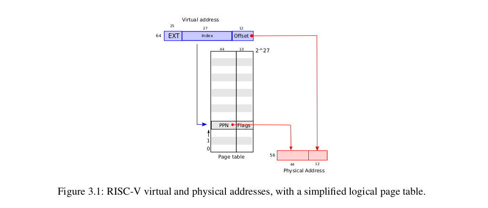
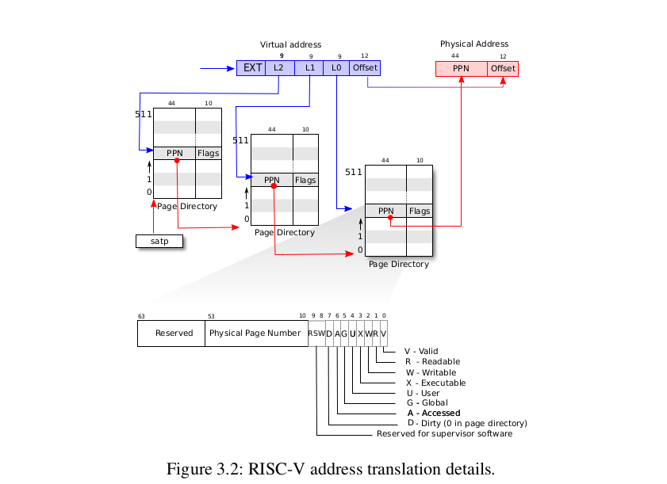
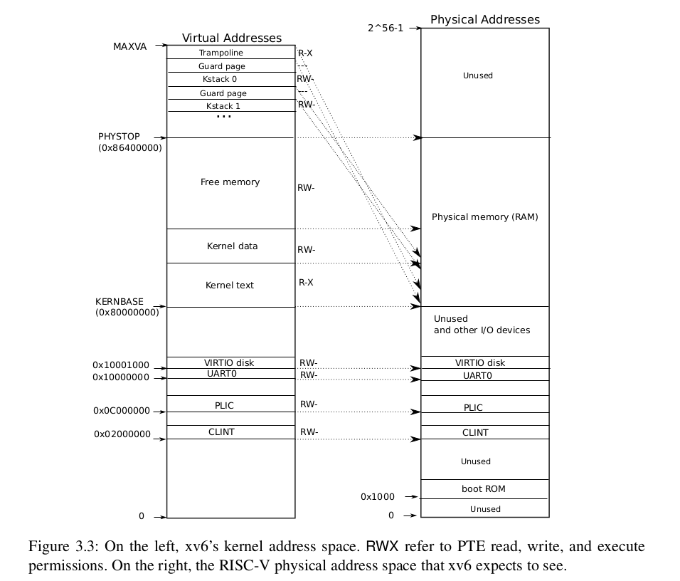
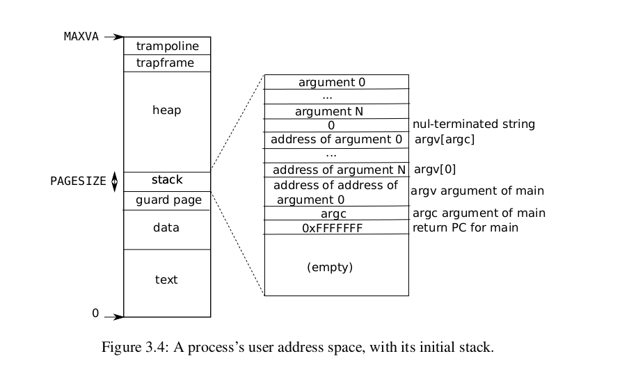

# **第3章 页表**

操作系统通过页表机制实现了对内存空间的控制。

页表确定内存地址的含义，以及可以访问物理内存的哪些部分。它们允许xv6隔离不同进程的地址空间，并将它们多路复用到单个物理内存中。另外，xv6使用了一些简单的技巧，比如把不同地址空间的多段内存映射到同一段物理内存(`trampoline page`)**在同一地址空间中多次映射同一段物理内存，以及通过一个没有映射的页保护内核和用户栈。**

本章其余部分将解释RISC-V硬件提供的页表以及xv6如何使用它们。

## 3.1 分页

risc-v的指令(用户和内核均是如此)计算使用的都是虚拟地址。机器的RAM，或者说物理内存，则是用物理地址来进行标记的。risc-v的分页硬件通过映射机制将虚拟地址和物理地址联系起来。（下面统称物理地址为PA（physical address），虚拟地址为VA（virtual address））

xv6在Sv39 RISC-V上运行，根据SV39的约定，64位的VA只使用处于低位的39位；不使用处于高位的前25位。在Sv39中，RISC-V页表在逻辑上是一个由2^27个PTE(Page Table Entry)组成的数组。每个PTE包含一个44位的PPN(physical page node)和一些标志(Flags)。 分页通过页表来查询一个VA(27位)对应的PPN。一个完整的56位的PA组成是由一个44位的PPN和一个12offset组成的。

图3.1显示了这个过程，并将页表的逻辑视图作为一个简单的PTE数组显示出来（更详细的故事请参见图3.2）。一个页表允许操作系统以4KB(2^12byte)的对齐块控制虚拟到物理地址转换。这样的一个块被称为一个页。



>   在Sv39 RISC-V中，虚拟地址的前25位不用于转换；未来，RISC-V可能会使用这些位来定义更多的翻译级别。物理地址也有增长空间：在PTE格式中，物理页码还有空间再增长10位。



**risc-v使用了一个三级页表。**

如图3.2所示，实际翻译分三步进行。 分页通过VA的前9位在一级页表中查询此VA对应的二级页表，二级页表通过VA的中间9位，重复这个操作，找到对应的三级页表，三级页表的作用是，通过PTE将VA转化成了PPN，只不过这里的VA只剩9位了。如果转换地址所需的三个PTE中的任何一个不存在，则分页硬件引发`page-fault exception`，由内核处理该异常(请参阅第4章)。

虽然CPU在硬件中执行执行加载或存储指令的三级结构，但三级的潜在缺点是CPU必须从内存加载三个PTE来执行加载/存储指令中的虚拟地址转换为物理地址。为了避免从物理内存中加载PTE的成本，RISC-VCPU将页面表条目缓存在TLB中。

**三级页表的结构是一种对于内存空间的巨大节约。**一方面，页表需要加载到内存中，如果一个程序的一级页表的PTE为空，那么相应的二级页表根本不会存在，而对于一个典型的程序而言，虚拟内存的大半部分均为未映射的。另一方面，只有一级页表才需要放在缓存中，二级页表只需按需调入调出，不必将整个页表也放入缓存中。

**每个PTE都包含标志位，说明虚拟地址的使用权限。**`PTE_V`表示 PTE 是否存在于页表中：如果未设置，那么一个对该页的引用会引发错误(也就是：不允许被使用)。`PTE_W`控制着能否对页执行写操作；`PTE_R` 控制是否允许使用指令读取页。`PTE_X`控制CPU是否可以将页面内容解释为指令并执行它们。`PTE_U`控制着用户程序能否使用该页；如果不能，则只有内核能够使用该页。

这些标志位和所有其他与页表硬件相关结构在`(kernel/riscv.h)`中定义。图3-2中也列出了所有的标志位与名称。

为了使用页表，内核必须将一级页表的物理地址写入`satp`寄存器。CPU将使用自己的`satp`指向的页表来转换后续指令生成的所有地址。每个CPU都有自己的`satp`，因此不同的CPU可以运行不同的进程，每个进程都有自己的页表描述的专用地址空间。

通常，内核将所有的物理内存映射到它的页表中，这样它就可以使用load/store指令来读写物理内存中的任何位置。由于页表位于物理内存中，因此内核可以通过使用store指令写入PTE的虚拟地址来对页表中的PTE内容进行编程。

>   **注释:**
>
>   1.   物理内存是指DRAM中的存储单元。物理内存的一个字节有一个地址，称为物理地址。
>   2.   指令仅使用虚拟地址，分页将虚拟地址转换为物理地址，然后发送到DRAM硬件以读取或写入存储器。
>   3.   与物理内存和虚拟地址不同，虚拟内存不是物理对象，而是指内核提供的用于管理物理内存和虚拟地址的抽象和机制的集合。

## 3.2 内核地址空间

xv6为每个进程维护一个页表，描述每个进程的用户地址空间，另外还有一个页表，描述内核的地址空间。内核配置其地址空间的布局，来使自己可以在一些确定虚拟地址中访问物理内存和各种硬件资源。

图3.3显示了此布局如何将内核虚拟地址映射到物理地址。`kernel/memlayout.h`声明了xv6内核内存布局的常量。

`QEMU`模拟了一台包含RAM的计算机，从物理地址`0x8000000`开始，一直到`PHYSTOP(0x86400000)`。物理地址空间中低于`0x8000000`是一些`QEMU`模拟的I/O设备，如磁盘接口。内核可以通过读/写这些特殊的物理地址与设备进行交互；**这种读写是与设备硬件通信，而不是与RAM通信。**第4章解释了xv6如何与设备交互。

内核使用“直接映射”获取RAM和与设备通信。即在内核的地址空间中虚拟内存的地址与物理内存的地址是相同的。举个例子，内核本身是位于虚拟地址空间和物理内存中的`KERNBASE=0x8000000`。**(ps:xv6的映射都被设置的很简单，看下图可以发现，很多映射都是直线)**

**直接映射简化了读取或写入物理内存的内核代码。**例如，当`fork`为子进程分配用户内存时，分配器返回该内存的物理地址；`fork`在复制时直接将该地址作为虚拟地址，将父进程的用户内存分配给子进程。



有一些内核地址是不能被映射的:

-   `The trampoline page`
    它被映射到虚拟地址空间的顶部；用户页表具有相同的映射。第4章讨论了`The trampoline page`的作用，但我们在这里看到了一个有趣的页表用例；物理页(包含`The trampoline page`)在内核的虚拟地址空间中映射两次：一次在虚拟地址空间的顶部，一次使用直接映射
-   `The kernel stack pages`
    每个进程都有自己的内核堆栈，该堆栈被映射到较高的位置，因此xv6可以在其下方留下一个未映射的保护页。保护页的PTE无效(即未设置PTE_V)，因此如果内核溢出内核堆栈，可能会导致异常，内核将死机。如果没有保护页，溢出的堆栈将覆盖其他内核内存，从而导致不正确的操作。


比如`kernel stack`在虚拟内存中的地址很靠后。因为在它之下有一个未被映射的保护页，这个保护页的PTE_V是没有设置。这样，如果`Kstack`越界的话，它会碰到保护页，导致立即触发page fault，这样的结果好过内存越界之后造成的数据混乱。如果触发了一个panic（也就是page fault)，你就知道`Kstack`出错了。与此同时，由于保护页没有映射到任何的物理内存，仅仅占用了虚拟地址空间一段比较靠后的位置。同时，`Kstack`被映射了两次，在靠后的虚拟地址映射了一次，在`PHYSTOP`下的`Kernel data`中又映射了一次，但是实际使用的时候用的是上面的部分，因为有保护页会更加安全。

另一种设计是可能只存在直接映射，并使用直接映射地址处的堆栈。然而，在这种安排下，提供保护页将浪费一部分虚拟地址，否则这些虚拟地址将引用物理内存，这很不好。

内核将`trampoline`和内核文本的页面映射为具有`PTE_R`和`PTE_X`权限的页面。内核读取并执行这些页面中的指令。内核使用权限`PTE_R`和`PTE_W`映射其他页面，以便可以读取和写入这些页面中的内存。

## 3.3 Code：建立一个地址空间

大多数用于操作地址空间和页表的xv6代码都放在vm.c(kernel/vm.c:1)中。

核心的数据结构是`pagetable_t`，它实际上是指向RISC-V根页面的指针；页表可以是`kernel`页表，也可以是其中一个进程的页表。

通用的函数操作是:

-   `walk`，它使用每个级别的9位虚拟地址来查找下一级页表或最后一个页面(kernel/vm.c：87)的PTE。如果PTE无效，则尚未分配所需的页面；如果设置了alloc参数，walk将分配一个新的页面表页面，并将其物理地址放在PTE中。它返回树中最低层的PTE的地址(kernel/vm.c：97)。
-   以`kvm`开头的函数操作内核页表；以`uvm`开始的函数操作用户页表；
-   `copyout`和`copyin`将数据复制到作为系统调用参数提供的用户虚拟地址，并从中复制数据；
    它们位于`vm.c`中，因为它们需要显式转换这些地址，以便找到相应的物理内存。

在`boot loader`的早期，`main`调用`kvminit`(kernel/vm.c:22)来创建内核的页表。调用`kvminit`时，cpu还未启动分页硬件，因此地址直接指向物理内存。

`kvminit`首先分配一页物理内存来创建根页表。然后调用`kvmmap`来提供一些内核需要的翻译。这些转换包括内核的指令和数据、物理内存，以及实际上是设备的内存范围`kvmmap`(kernel/vm.c:118)调用`mappages`(kernel/vm.c:149)，它将虚拟地址范围到相应物理地址范围的映射加入到页表中。它以页面间隔为范围内的每个虚拟地址分别执行此操作。

对于要映射的每个虚拟地址，`mappages`调用`walk`来查找该地址的PTE地址。然后，它初始化PTE以保存相关的物理页码、所需的权限(`PTE_W`、`PTE_X`、`PTE_R`)和PTE_V以将PTE标记为有效(kernel/vm.c:161)。

**`walk`(kernel/vm.c:72)实际上做的是类似RISC-V分页的工作，即使用PTE查找虚拟地址对应的物理地址(见图3.2)。**walk每次将3级页面表向下移动9位。它使用每一级的9位虚拟地址来查找下一级页面表或最终页面(kernel/vm.c:78)的PTE。

-   如果PTE无效，则所需页面尚未分配；
-   如果设置了`alloc`参数，`walk`将分配一个新的页表页，并将其物理地址放入PTE中。返回树中最低层的PTE地址(kernel/vm.c:88)。
-   **上面的代码依赖于直接映射到内核虚拟空间的物理内存。**例如，当`walk`从页面表的各个级别向下移动时，它会从一个PTE(kernel/vm.c:80)中提取下一级别向下的页表的(物理)地址，然后将该地址用作虚拟地址，以在下一级别向下(kernel/vm.c:78)获取PTE。

`main`调用`kvminthart`(kernel/vm.c:53)来安装内核页表。它将根页表的物理地址写入寄存器`satp`。

在此之后，CPU将使用内核页表转换地址。由于内核使用直接映射，因此下一条指令的当前虚拟地址将映射到正确的物理内存地址。

从`main`调用的`procinit`(kernel/proc.c:26)为每个进程分配一个内核堆栈。它将每个堆栈映射到`KSTACK`生成的虚拟地址，这为无效的堆栈保护页留出了空间。`kvmmap`将映射PTE添加到内核页表中，对`kvminithart`的调用将内核页表重新加载到`satp`中，以便硬件获得新的PTE。

每个RISC-V CPU都将页表条目缓存在TLB中，当xv6更改页表时，它必须通知CPU使相应的缓存TLB条目无效。如果没有，那么稍后TLB可能会使用旧的缓存映射，指向同时已分配给另一个进程的物理页，因此，一个进程可能能够在其他进程的内存上涂鸦。RISC-V有一条指令`sfence.vma`，用于刷新当前CPU的TLB。xv6在重新加载`satp`寄存器后，在`kvminithart`中执行`sfence.vma`，并在返回用户空间之前切换到用户页表的`trampoline`代码中执行`sfence.vma`(kernel/trampoline.S:79)。

## 3.4 物理内存的分配

在运行时，内核需要为页表、进程的用户内存、内核栈及管道缓冲区分配空闲的物理内存。

xv6使用从内核结尾到 `PHYSTOP` 之间的物理内存为运行时分配提供内存资源。分配的基本单位是4KB的页。

xv6 还会通过维护一个物理页组成的链表来寻找空闲页。所以，分配内存需要将页移出该链表，而释放内存需要将页加入该链表。

***

实际上看到这里，你才能会做lab2中计算剩余内存的代码，即遍历这个freelist，然后获得其结点数，乘以4096，就是剩余内存的数量

## 3.5 代码：物理内存分配器

分配器(allocator)位于kalloc.c(kernel/kalloc.c:1)中。分配器的数据结构是可供分配的物理内存页的空闲链表。每个空闲页的链表表元素是一个`struct run`(kernel/kalloc.c:17)。

**分配器从哪里获得内存来填充该数据结构呢？**

>   它将每个空闲页的`run`结构存储在空闲页本身，因为在那里没有存储其他东西。空闲列表受到自旋锁（spin lock）的保护(***kernel/kalloc.c\***:21-24)。列表和锁被封装在一个结构体中，以明确锁在结构体中保护的字段。现在，忽略锁以及对`acquire`和`release`的调用；第6章将详细查看有关锁的细节。

`main`函数调用`kinit`(kernel/kalloc.c:27)来初始化分配器。`kinit`初始化空闲列表以保存从内核结束到`PHYSTOP`之间的每一页。xv6应该通过解析硬件提供的配置信息来确定有多少物理内存可用。然而，xv6假设机器有128兆字节的RAM。`kinit`调用`freerange`将内存添加到空闲列表中，在`freerange`中每页都会调用`kfree`。PTE只能引用在4096字节边界上对齐的物理地址（是4096的倍数），所以`freerange`使用`PGROUNDUP`来确保它只释放对齐的物理地址。分配器原本一开始没有内存可用，正是对 `kfree` 的调用将可用内存交给了分配器来管理。

分配器有时将地址看作是整型，这是为了对其进行运算(譬如在 `kinit` 中遍历所有页)；而有时将地址看作读写内存用的指针(譬如操作每个页中的 `run` 结构体)；对地址的双重使用导致分配器代码中充满了类型转换。另外一个原因是，释放和分配内存隐性地改变了内存的类型。

>   实际上在做lab2 syscall中的sysinfo也用过这个技巧

函数 `kfree`(2815)首先将被释放内存的每一字节设为 1。这使得访问已被释放内存的代码所读到的不是原有数据，而是垃圾数据；这样做能让这种错误的代码尽早崩溃。接下来 `kfree` 把 `v` 转换为一个指向结构体 `struct run` 的指针，在 `r->next` 中保存原有空闲链表的表头，然后将当前的空闲链表设置为 `r`。`kalloc` 移除并返回空闲链表的表头。

## **3.6 进程地址空间**



每个进程都有一个单独的页表，当xv6在进程之间切换时，它也会更改页表。如图2.3所示，进程的用户内存从虚拟地址0开始，可以增长到MAXVA(kernel/riscv.h:348)，原则上允许进程寻址256GB的内存。

当进程向xv6请求更多用户内存时，xv6首先使用kalloc分配物理页面。然后，它将PTE添加到进程的页表中，该表指向新的物理页。Xv6在这些PTE中设置PTE_W、PTE_X、PTE_R、PTE_U和PTE_V标志。大多数进程不使用整个用户地址空间；xv6使未使用的PTE中的PTE_V保持清除状态。

**我们在这里看到了一些使用页表的好例子。**首先，不同进程的页表将用户地址转换为物理内存的不同页，这样每个进程都有专用用户内存。其次，每个进程将其内存视为具有从零开始的连续虚拟地址，而进程的物理内存可以是非连续的。第三，内核在用户地址空间的顶部映射一个带有`trampoline`代码的页面，因此在所有地址空间中都会显示一页物理内存。

图3.4更详细地显示了xv6中执行进程的用户内存布局。堆栈是一个页，显示的初始内容与exec创建的内容相同。栈的最上方放着字符串形式的命令行参数以及指向这些参数的指针数组，其下方放的值使得一个程序可以从 `main` 开始，仿佛刚刚调用了函数 `main(argc, argv)`。为了防止栈使用了它不应该使用的页，栈的下方有一个保护页。因此当栈的增长超出其所在页时就会产生异常，因为无法翻译这个错误的地址。

实际操作系统可能会在用户堆栈溢出时自动为其分配更多内存。

### **3.7 Code ：`exec`**

`exec` 是创建地址空间中用户部分的系统调用。它根据文件系统中保存的某个文件来初始化用户部分。。`exec`(kernel/Exec.c:13)通过 `namei`(kernel/exec.c:26)打开二进制文件，这一点将在第6章进行解释。

然后，它读取 ELF 头。xv6 应用程序以通行的 ELF 格式来描述，该格式在 `elf.h` 中定义。

一个 ELF 二进制文件包括了一个 ELF 头，即结构体 `struct elfhdr`(kernel/ELF.h:6)，然后是连续几个程序段的头，即结构体 `struct proghdr`(kernel/ELF.h:25)。每个 `proghdr` 都描述了需要载入到内存中的程序段。xv6 中的程序只有一个程序段的头，但其他操作系统中可能有多个。

`exec` 第一步是检查文件是否包含 ELF 二进制代码。一个 ELF 二进制文件是以4个“magic number”开头的，即 0x7F，“E”，“L”，“F”，或者写为宏 `ELF_MAGIC`(kernel/ELF.h:3)。如果 ELF 头中包含正确的魔法数字，`exec` 就会认为该二进制文件的结构是正确的。

`exec` 通过`proc_pagetable`(kernel/Exec.c:38)分配了一个没有用户部分映射的页表，使用`uvmalloc`(kernel/exec.c:52)为每个ELF段分配内存，并使用`loadseg`(kernel/exec.c:10)将每个段加载到内存中。`loadseg`使用`walkaddr`查找分配内存的物理地址，在该地址写入ELF段的每一页，并读取从文件中读取的内容。

`exec` 创建的第一个用户程序 `/init` 程序段的头是这样的：

```text
 # objdump -p _init
 
 user/_init:     file format elf64-littleriscv
 Program Header:
 
     LOAD off 0x00000000000000b0 vaddr 0x0000000000000000
                                 paddr 0x0000000000000000 align 2**3
         filesz 0x0000000000000840 memsz 0x0000000000000858 flags rwx
     STACK off 0x0000000000000000 vaddr 0x0000000000000000
                                  paddr 0x0000000000000000 align 2**4
         filesz 0x0000000000000000 memsz 0x0000000000000000 flags rw-
```

程序段头中的 `filesz` 可能比 `memsz` 小，这表示中间相差的地方应该用 0 填充(对于 C 的全局变量)而不是继续从文件中读数据。对于 `/init`，`filesz` 是 2112 字节而 `memsz` 是 2136 字节。所以 `uvmalloc` 会分配足够的内存来装 2136 字节的内容，但只从文件 `/init` 中读取 2112 字节的内容。

现在 `exec` 要分配以及初始化用户栈了。它只为栈分配一页内存。`exec` 一次性把参数字符串拷贝到栈顶，然后把指向它们的指针保存在 `ustack` 中。它还会在 `main` 参数列表 `argv` 的最后放一个空指针。这样，`ustack` 中的前三项就是伪造的返回 PC，`argc` 和 `argv` 指针了。

`exec` 会在栈的页下方放一个无法访问的页，这样当程序尝试使用超过一个页的栈时就会出错。另外，这个无法访问的页也让 `exec` 能够处理那些过于庞大的参数；当参数过于庞大时，`exec` 用于将参数拷贝到栈上的函数 `copyout` 会发现目标页无法访问，并且返回 -1。

在创建新的内存映像时，如果 `exec` 发现了错误，比如一个无效的程序段，它就会跳转到标记 `bad` 处，释放这段内存映像，然后返回 -1。`exec` 必须在确认该调用可以成功后才能释放原来的内存映像，否则，若原来的内存映像被释放，`exec` 甚至都无法向它返回 -1 了。`exec` 中的错误只可能发生在新建内存映像时。一旦新的内存映像建立完成，`exec` 就能装载新映像而把旧映像释放。最后，`exec` 成功地返回 0。释放旧映像直到确定系统调用将成功：如果旧映像消失，系统调用将无法返回-1。exec中唯一的错误情况发生在创建映像期间。映像完成后，`exec`可以提交到新的页表(kernel/exec.c:113)并释放旧的页表(kernel/exec.c:117)。

`exec`将ELF文件中的字节加载到ELF文件指定地址的内存中。用户或进程可以将他们想要的任何地址放入ELF文件中。因此exec是有风险的，因为ELF文件中的地址可能会意外或故意引用内核。

粗心的后果可能是内核的崩溃到恶意破坏内核的隔离机制(即安全漏洞攻击)。

xv6执行了大量检查以避免这些风险。例如，如果`(ph.vaddr+ph.memsz<ph.vaddr)`检查总和是否溢出64位整数。危险在于，用户可能会构造一个ELF二进制文件，其中的`ph.vaddr`指向用户选择的地址，而`ph.memsz`足够大，以至于总和溢出到0x1000，这看起来像是一个有效值。在旧版本的xv6中，用户地址空间也包含内核(但在`User mode`下不可读写)，用户可以选择与内核内存相对应的地址，从而将数据从ELF二进制文件复制到内核中。在xv6的RISC-V版本中，这是不可能发生的，因为内核有自己单独的页表；`loadseg`加载到进程的页表中，而不是内核的页表中。

内核开发人员很容易省略关键的检查，而实际生活中的内核有很长一段丢失检查的历史，用户程序可以利用这些检查的缺失来获得内核特权。xv6可能没有完成验证提供给内核的用户级数据的全部工作，恶意用户程序可以利用这些数据来绕过xv6的隔离。

### **3.8 Code：`sbrk`**

`sbrk`是一个用于进程减少或增长其内存的系统调用。这个系统调用由函数`growproc`实现(kernel/proc.c:239)。

`growproc`根据`n`是正的还是负的调用`uvmalloc`或`uvmdealloc`。

`uvmalloc`(kernel/vm.c:229)用`kalloc`分配物理内存，并用`mappages`将PTE添加到用户页表中。`uvmdealloc`调用`uvmunmap`(kernel/vm.c:174)，`uvmunmap`使用`walk`来查找对应的PTE，并使用`kfree`来释放PTE引用的物理内存。

xv6使用进程的页表，不仅是告诉硬件如何映射用户虚拟地址，也是明晰哪一个物理页面已经被分配给该进程的唯一记录。这就是为什么释放用户内存（在`uvmunmap`中）需要检查用户页表的原因。

### **3.9 现实情况**

与大多数操作系统一样，xv6使用分页硬件进行内存保护和映射。大多数操作系统通过结合分页和页面错误异常(我们将在第4章中讨论)，对分页的使用要比xv6复杂得多。

通过内核使用虚拟地址和物理地址之间的直接映射，以及假设在内核预期加载的地址0x8000000处存在物理RAM，Xv6得到了简化。这在QEMU上是可行的，但在真正的硬件上，这是一个坏主意；真正的硬件将RAM和设备放置在不可预测的物理地址，例如0x8000000处可能没有RAM，而xv6期望能够存储内核。**更严肃的内核设计利用页表将任意硬件物理内存布局转换为可预测的内核虚拟地址布局。**

RISC-V支持物理地址级别的保护，但xv6不使用该功能

在内存较多的机器上使用 x86 的 4MB 大小的“超级页”还是很划算的，能够减少页表的工作负担。而内存较小时，就比较适合用比较小的页，使得分配和向磁盘换出页时都拥有较细的粒度。譬如，当一个程序只需 8KB 的内存时，分配 4MB 的页就太浪费了。

xv6内核缺少类似malloc的分配器，无法为小对象提供内存，这使得内核无法使用需要动态分配的复杂数据结构。

内存分配曾经是一个热门话题，其主要问题就是如何对有限内存进行高效使用，以及如何为可能出现的各种内存请求做好准备；

>   相关资料请搜索 Knuth。

今天人们更加关心速度，而非空间利用率。另外，精巧的内核往往会分配不同大小的内存块，而不是像 xv6 一样固定分配 4096 字节；实际使用的内存分配器必须做到，对小块内存和大块内存的分配请求都能很好地处理。

### **3.10 练习**

1.  解析RISC-V的设备树以查找计算机的物理内存量。
2.  编写一个用户程序，通过调用sbrk(1)将其地址空间增加一个字节。在调用sbrk之前和调用sbrk之后，运行程序并检查程序的页表。内核分配了多少空间？新内存的PTE包含什么？
3.  修改xv6以对内核使用超级页面。
4.  修改xv6，以便当用户程序取消引用空指针时，它将收到异常。也就是说，修改xv6以使虚拟地址0不映射到用户程序。
5.  exec的Unix实现传统上包括对shell脚本的特殊处理。如果要执行的文件以文本#！开头！，然后，第一行被视为运行以解释文件的程序。例如，如果调用exec来运行myprog arg1，而myprog的第一行是#/interp，然后exec使用命令行/interp myprog arg1运行/interp。在xv6中实现对此约定的支持。
6.  为内核实现地址空间随机化。

>   **注释:** 
>
>   -   物理内存是指DRAM中的存储单元。物理内存的一个字节有一个地址，称为物理地址。
>   -   指令仅使用虚拟地址，分页将虚拟地址转换为物理地址，然后发送到DRAM硬件以读取或写入存储器。
>   -   与物理内存和虚拟地址不同，虚拟内存不是物理对象，而是指内核提供的用于管理物理内存和虚拟地址的抽象和机制的集合。
